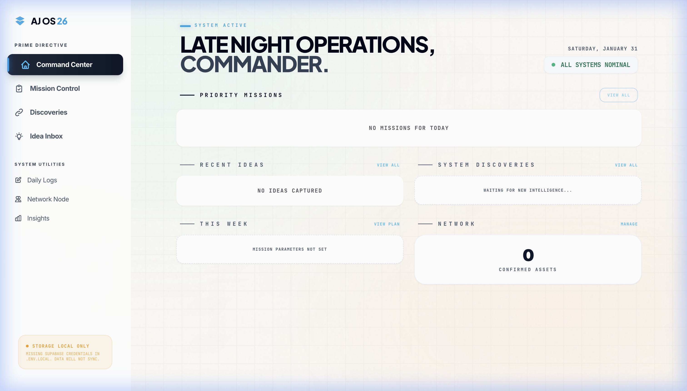

# AJ OS



**A unified personal operating system for productivity-focused individuals.**

AJ OS is a web application designed to consolidate the fragmented tools that builders, creators, and knowledge workers typically juggle. Instead of switching between a notes app, task manager, idea tracker, contact list, and analytics dashboard, AJ OS brings everything into a single, cohesive interface.

The core philosophy is simple: capture everything, organize naturally, and execute without friction. Every feature is built around this principle, with an emphasis on speed, keyboard navigation, and zero cognitive overhead.

---

## Why This Exists

Most productivity systems fail for one of two reasons: they're either too simple to handle real complexity, or so feature-rich that using them becomes work itself. AJ OS aims for the middle ground, providing structure where it matters while staying out of your way everywhere else.

The system is opinionated about workflow. It assumes you think in terms of daily logs, weekly cycles, and long-running missions. It expects you to capture ideas immediately and revisit them later. It treats contacts as valuable context, not just phone numbers.

If that matches how you work, this might be useful. If not, the codebase is open and straightforward to modify.

---

## Features

### Command Center
The dashboard. Shows today's priorities, recent ideas, and quick-access to everything else. Designed to answer "what should I focus on right now?" in under two seconds.

### Mission Control
Task management with deadlines, priorities, and status tracking. Supports pinning critical tasks to the top, filtering by completion state, and tracking when tasks were actually finished (not just marked done).

### Idea Inbox
A capture zone for thoughts, content drafts, and future projects. Categorize by type (Content, Product, Deep Work, Life, Growth), mark urgency levels, and track which ideas have been executed. Built with dedicated support for social content (X/LinkedIn).

### Daily Logs
Structured journaling. Each entry captures what you worked on and what you shipped. Designed for quick daily entries that build into a valuable historical record.

### Discoveries
A repository for external knowledge. Save articles, tools, resources, and references with impact ratings. Think of it as bookmarks that you'll actually use.

### Network Node
Contact management for professionals. Stores role, company, LinkedIn, X handle, email, and personal notes. Built for networking, not just storing phone numbers.

### Insights
Analytics on your own behavior. Tracks logging streaks, task completion rates, idea execution, and weekly patterns. All computed locally from your data.

---

## Tech Stack

| Layer | Technology |
|-------|------------|
| Framework | React 19 with TypeScript |
| Styling | Tailwind CSS |
| Database | Supabase (PostgreSQL with Row Level Security) |
| Build Tool | Vite |
| Mobile | Capacitor (optional, for iOS/Android compilation) |

The architecture follows an offline-first pattern. All data is cached to localStorage immediately, then synced to Supabase when available. If the sync fails, the local cache serves as the source of truth and changes are retried later.

---

## Getting Started

### Prerequisites

- Node.js 18 or higher
- npm (comes with Node.js)
- A Supabase account (free tier works fine)

### Installation

Clone the repository:

```bash
git clone https://github.com/your-username/aj-os.git
cd aj-os
```

Install dependencies:

```bash
npm install
```

### Configuration

Copy the example environment file:

```bash
cp .env.example .env.local
```

Open `.env.local` and add your Supabase credentials:

```env
VITE_SUPABASE_URL=https://your-project.supabase.co
VITE_SUPABASE_ANON_KEY=your-anon-key
```

To get these values:
1. Create a project at [supabase.com](https://supabase.com)
2. Go to Project Settings, then API
3. Copy the Project URL and the `anon` public key

### Database Setup

In your Supabase dashboard, open the SQL Editor and run the schema file:

```
docs/database/SUPABASE_SCHEMA_CURRENT.sql
```

This creates all required tables with Row Level Security policies.

### Running Locally

Start the development server:

```bash
npm run dev
```

Open [http://localhost:3000](http://localhost:3000) in your browser.

### Building for Production

```bash
npm run build
```

Output goes to the `dist/` directory, ready for deployment to any static host.

---

## Project Structure

```
aj-os/
├── src/
│   ├── components/      # React components for each module
│   ├── lib/             # Core utilities (storage, database, security)
│   ├── config/          # Application configuration
│   ├── styles/          # Global CSS
│   ├── App.tsx          # Main application shell
│   └── index.tsx        # Entry point
├── docs/
│   └── database/        # SQL schemas and migrations
├── index.html           # HTML template
├── vite.config.ts       # Build configuration
└── package.json         # Dependencies
```

### Key Files

- `src/lib/store.ts` - The storage engine. Handles all data operations with localStorage caching and Supabase sync.
- `src/lib/supabase.ts` - Database client configuration.
- `src/lib/security.ts` - Input sanitization and rate limiting.
- `src/config/index.ts` - Centralized configuration and feature flags.

---

## Running Without Supabase

If you skip the Supabase setup, the app runs in local-only mode. All data is stored in the browser's localStorage. This is fine for trying things out, but note that:

- Data is tied to a single browser
- Clearing browser data deletes everything
- No sync between devices

The app will display a "STORAGE LOCAL ONLY" indicator when running in this mode.

---

## Security

All user inputs are sanitized before storage to prevent XSS and injection attacks. Database operations are rate-limited. Environment variables are used exclusively for sensitive credentials.

Supabase Row Level Security policies ensure that each user can only access their own data. The anon key used in the frontend is safe to expose, as RLS policies enforce access control at the database level.

See `SECURITY.md` for detailed information.

---

## Contributing

Pull requests are welcome. For significant changes, please open an issue first to discuss the approach.

The codebase is intentionally straightforward. Components are self-contained, the store is a single file, and there's minimal abstraction. This is by design, to keep the system understandable and modifiable.

---

## License

MIT
